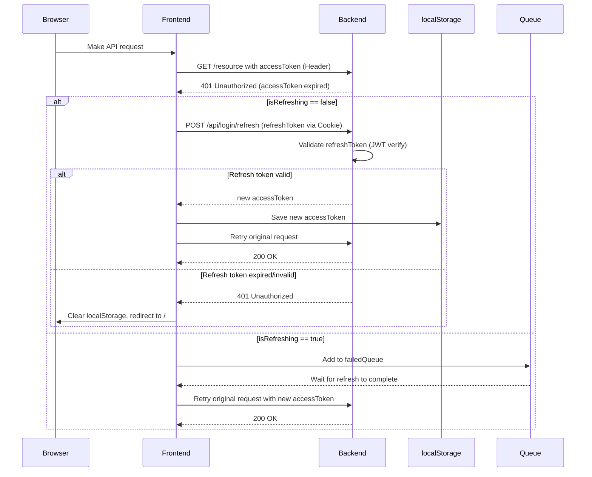

# Code overview

The application is hosted on Heroku. The public URL (for this deployment) is [www.prone-materiaalipankki.fi](https://www.prone-materiaalipankki.fi) which is an alias directing traffic to Heroku.

Personal information is saved encrypted. This is likely over-provisioned for the current scope, but was implemented and tested in case customer (sensitive) information needs to be stored in future (for example healthcare-related customer records).

## Role based access control

The application has a simple role based access control. Roles are visible in `frontend/src/config/userRoles.js` and may be extended there. The routes and page links are defined in `frontend/src/config/RoutesConfig.jsx`. For each route the allowed roles are defined in that config and enforced by the frontend and backend authorization middleware.

Note: The backend should always enforce role/permission checks — frontend checks are for UX only.

## Access and refresh tokens

The application uses short-lived access tokens and longer-lived refresh tokens. Access tokens are stored in `localStorage`; refresh tokens are stored as cookies and handled by the backend login controller.

The backend login controller exposes a refresh endpoint under the login API, for example: `POST /api/login/refresh`. The frontend uses Axios interceptors (`frontend/src/services/api.js`) to detect `401 Unauthorized` responses caused by an expired or invalid access token. On receiving a 401 the frontend will attempt to refresh the access token using the refresh token (sent as an HTTP cookie). If refresh succeeds, the frontend retries the original request with the new access token. If refresh fails (refresh token expired/invalid) the frontend clears local state and redirects the user to the login page.

Important nuance:
- A 401 from the backend typically means the access token is invalid or expired.
- The frontend then calls the refresh endpoint with the refresh token.
- If refresh returns 200 with a new access token, the original request is retried.
- If refresh fails (e.g., refresh token has expired), the user is logged out.

The frontend implements a queue to avoid concurrent refresh requests when multiple requests fail at once. See `frontend/src/services/api.js` for the implementation details.
        
Sequence diagram (high level)


## Cloud service / timeouts

The application runs in a cloud service; the current deployment uses a singledyno/VM which may hibernate and cause an initial cold-start delay. Because of this, reasonable timeouts are configured in the frontend API client.

`frontend/src/services/api.js` defines a global request timeout and handles token refresh. The login service (`frontend/src/services/login.js`) sets its own axios timeout and uses `withCredentials: true` for cookie-based refresh/logout.

Some browser extensions may interfere with login in certain environments (there are known cases where an extension causes an error like `Cannot read properties of undefined (reading 'data')` during login). Opening the site in an incognito mode sometimes avoids such extension-caused issues.

## Materials and deleted users (defensive behavior)

The backend materials endpoints return material metadata and the creating user (if present). In deployments where user rows might be removed (full delete), the materials endpoint has a defensive fallback: when no creating user is present the API returns a harmless placeholder user object (for example: `first_name: 'poistettu'`, `last_name: 'käyttäjä'`) so the frontend can render material details without runtime errors.

If you plan to implement irreversible anonymization instead of deletion, a recommended improvement is to populate a non-PII display name on the material at creation time (for example `authorDisplayName` on the `materials` table). That way you can preserve readable author attribution without keeping the user's PII in the system.

## Storage of PII and backups

Personal data is encrypted (see `backend/utils/encryptions.js`). Be aware that encrypted data is still personal data if the encryption key exists and can be used to decrypt. For GDPR erasure requests you must ensure any backups or logs that contain PII are handled according to your retention policy and legal requirements.

## Testing

Unit tests are written with Vitest. Integration/E2E tests are implemented with Playwright. The e2e test suite uses a separate PostgreSQL database running in Docker for test isolation — make sure that DB is running and the test back- and frontend are started in test mode before running E2E tests to avoid affecting production data.

Quick commands (examples)

```powershell
# Run unit tests (from repo root or frontend/backend as needed)
# If your package.json has a test script, run:
npm test

# Or run vitest directly from the frontend
cd frontend
npx vitest

# Run Playwright e2e tests (start back- and frontend in test mode first, ensure the Postgres test DB Docker container is running)
npx playwright test
```

## Other notes

- Role names are defined in `frontend/src/config/userRoles.js`.
- Routes with required roles are configured in `frontend/src/config/RoutesConfig.jsx`.
- The backend uses auth middleware to enforce required roles for each API route.
- Avoid storing PII in application logs; mask or redact sensitive fields in structured logs if possible.
- For lawful retention requirements or legal holds you should document the justification and retention periods.

## Cloud / operational tips

- Keep a documented process to handle PII in backups (deletion/scrubbing or retention justification).
- Revoke refresh tokens and active sessions when anonymizing or deleting users.
- Use transactions for anonymization/delete operations that must update multiple tables to avoid partial state.
