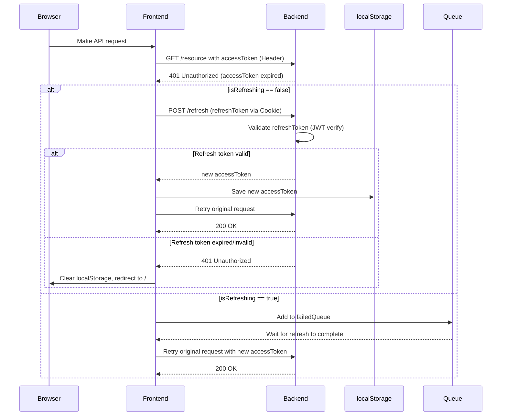

# Code overview

The application is hosted on Heroku. The actual URL [www.prone-materiaalipankki.fi](https://www.prone-materiaalipankki.fi) is an alias that directs traffic to Heroku.

Personal information is saved encrypted. This is an overkill, but it was tested in case customer information would be stored in the future. Customer information would be considered as healthcare information.

## Role based access control

The application has simple role based access control. Roles are visible in the [`userRoles.js`](/frontend/src/config/userRoles.js) file, where they can also be added. The file [`RouterConfig.jsx`](/frontend/src/config/RoutesConfig.jsx) contains the application links. For each link, the roles that are allowed to use the link are defined.

## Access and refresh tokens

The application uses access and refresh tokens. They are set in [`login.js`](/backend/controllers/login.js) file in backend. In frontend api service [`api.js`](/frontend/src/services/api.js) employs Axios interceptors to handle authentication and refresh tokens. Refresh tokens are saved as cookies.

The refresh token causes unauthorized error messages *401 (Unauthorized)* in the console. This happens when the refresh token has expired and the user tries to use the application. If the access token is still valid the application receives a new refresh token from backend.

## Cloud service

The application is located in a cloud service. The cloud service now only has one virtual machine in use, which goes into hibernation. This causes slowness when the virtual machine starts. Therefore, a timeout has been added to the services. [`api.js`](/frontend/src/services/api.js) handels timeout for all the other services except for [`login.js`](/frontend/src/services/login.js) which has its own timeout defined.

Some browser extensions such as F-secure cause an console error when logging in. A type error is shown in the console: *loginhandler.js:366 Uncaught TypeError: Cannot read properties of undefined (reading 'data')*. If the application is opened in an incognito mode the error is not shown.
