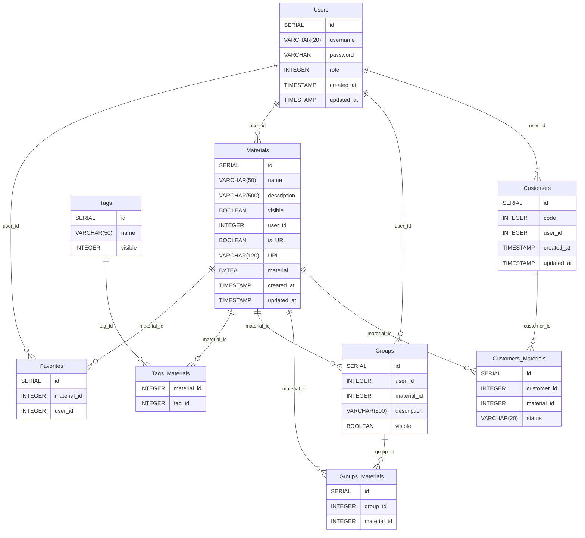

# Database

PostgrSQL was chosen, because it offers ACID transactions.

## Schema

Schema is based around materials. Each material has a single user who has downloaded that material to the database. Each material can have several tags which mark what the material is used for. Each user has a favorites list where they can mark their favorite materials. Admins can create groups to which group of materials can be added for a specific purposes. Customers are end users to whom the user gives the materials. User can then mark if the material has been given to the customer and whether the customer has completed the materials.

There are timestamps on materials, users and customers. Timestamps for users give information when the password has been renewed last time. Password is forced to renew at least once a year. Timestamps for customers are for GDPR purposes. When the customer ends his/her customership with ProNeuron the data is kept 3 years and then deleted. Timestamps for materials have no use at the moment, but are inserted for future use.

Here is the [PostgerSQL schema](../backend/dBStartup/schema.sql).
