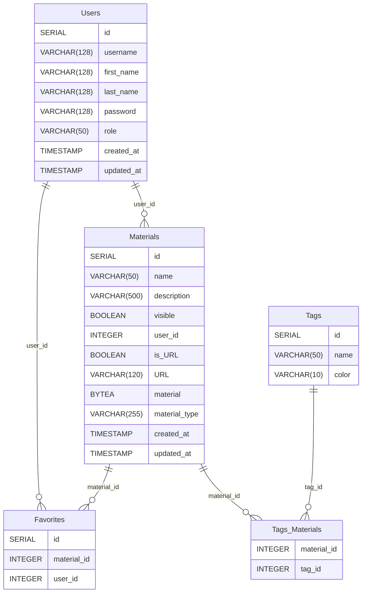

# Database

PostgrSQL was chosen, because it offers ACID transactions. There will only be hundreds of users and materials. Material files can be pdf-, word-, powerpoint, excel or picture files or a link to another webpage. Most of them have single page. Because of that it was decided to upload material files to Postgres as blobs.

## Schema

Schema is based around materials. Each material has a single user who has uploaded that material to the database. Each material can have several tags which mark what the material is used for. Each user has a favorites list where they can mark their favorite materials.



There are timestamps on materials and users. Timestamps for users give information when the password has been renewed last time. Password is forced to renew at least once a year. Timestamps for materials have no use at the moment, but are inserted for future use. PostgreSQL triggers are used to update timestamps updated_at.

Sequelize is used for queries. It does not handle database-level triggers. The schema has been run directly to the database. To avoid problems do not use ```sequelize.sync()``` with ```force``` or ```alter``` options.

Here is the [PostgerSQL schema](../backend/dBStartup/schema.sql).
